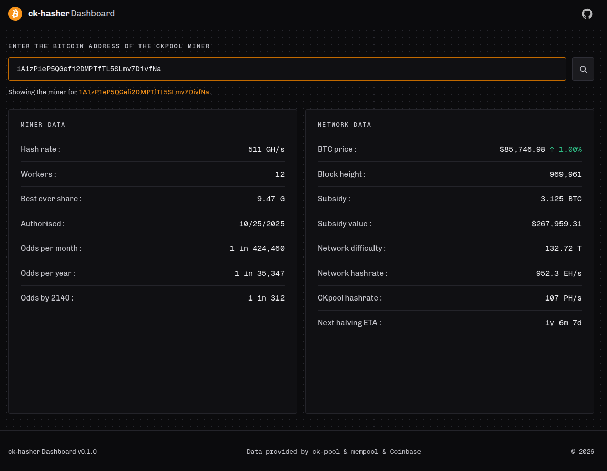

# ck-hasher

A dashboard for CK-Pool Bitcoin miners.
Enter a Bitcoin address, the dashboard finds the miner that belongs to the
address. The dashboard then shows the miner data and network data.

## Live deployment : https://ck-hasher.vercel.app/

## Data Sources

- **CK-Pool.** Look up address to find workers. https://solo.ckpool.org/
- **Coinbase WebSocket.** The feed returns the live BTC price.
- **Mempool.space** Fetches the block height,
  the network difficulty and more.

## Tech Stack

- JavaScript, HTML, and CSS for the frontend
- Python scripting
- Vercel deployment

## Contribute

If you would like to contribute, send BTC contributions here: `bc1qltty5ezggulw7nkl2dx3vmxvg6flyg5lajpjlp`

## Preview

